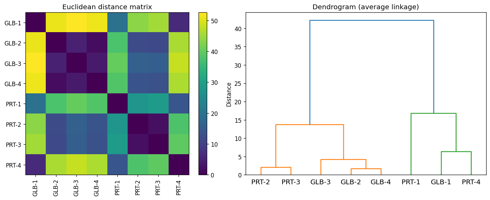

# Prioritizing candidate genes using the moment of inertia tensor

Reference implementation of the alignment-free gene-prioritization method from:

> Thummadi NB, **T Mallikarjuna**, Vindal V, Manimaran P.
> *Prioritizing the candidate genes related to cervical cancer using the moment of inertia tensor.*
> **Proteins.** 2022;90(2):363–371. doi:[10.1002/prot.26226](https://doi.org/10.1002/prot.26226)

## Overview

Every amino acid is mapped to a fixed point in 3D space (a point on the unit
circle in the x–y plane, with the z coordinate encoding a physicochemical
property). A protein sequence therefore becomes a cloud of points, and the
**moment of inertia tensor** of that cloud gives three eigenvalues that serve as a
compact, alignment-free descriptor of the sequence.

Using these descriptors the pipeline:

1. Encodes every experimentally verified and every candidate protein.
2. Builds a Euclidean **distance matrix** between candidate and known genes.
3. Thresholds it into a binary similarity matrix and scores each candidate by the
   number of known genes it resembles.
4. Ranks candidates and visualizes them with a **dendrogram**.

Applied to cervical cancer, the method surfaced 14 candidate genes highly similar
to known cervical-cancer genes, which were then examined by GO-term and KEGG
pathway analysis.

## Contents

```
.
├── gene_prioritization.ipynb   # end-to-end, documented walkthrough
├── tensor_prioritization.py    # reusable library (descriptor, distance, ranking)
├── run_example.py              # offline demo: descriptors -> distance matrix -> dendrogram
├── fretrieve.csv               # candidate & experimental gene lists (UniProt entries)
├── example_output.png          # figure produced by the example
├── requirements.txt
├── LICENSE
└── README.md
```

## Getting started

```bash
git clone https://github.com/arjunbioinfo/moment-of-inertia-tensor-gene-prioritization.git
cd moment-of-inertia-tensor-gene-prioritization

python -m venv .venv && source .venv/bin/activate   # optional
pip install -r requirements.txt
```

NCBI requires a contact email for Entrez / E-utilities requests. Set yours before
running:

```bash
export ENTREZ_EMAIL="your.email@example.com"
```

Then open the notebook:

```bash
jupyter notebook gene_prioritization.ipynb
```

## Quick example

For a self-contained demo that needs **no network access**, run:

```bash
python run_example.py
```

It encodes eight short protein fragments (two loose families) into their
eigenvalue descriptors, builds a Euclidean distance matrix, and clusters them:



The two families separate cleanly in both the heatmap and the dendrogram, showing
the alignment-free descriptor capturing sequence similarity.

## Library usage

```python
from tensor_prioritization import retrieve, distance_matrix, prioritize

experimental = retrieve(["NP_000034.1", "NP_001617.1"], email="your.email@example.com")
candidates   = retrieve(["NP_000198.1", "NP_000199.2"], email="your.email@example.com")

dmat    = distance_matrix(experimental, candidates)
ranking = prioritize(dmat, min_frequency=6)
print(ranking.head(14))
```

## Data

`fretrieve.csv` contains two column pairs: `Candidate, Entry` and
`Experimental, Entry`, where each `Entry` is a UniProt accession. The candidate
and experimental lists have different lengths, so trailing empty rows are ignored
when the file is loaded.

## Notes

- Downloading thousands of sequences from NCBI is slow and rate-limited. For large
  runs, batch the requests or cache the FASTA files locally.
- This repository reproduces the published method; it is intended for research and
  educational use.

## Citation

If you use this code, please cite the original article:

```bibtex
@article{thummadi2022prioritizing,
  title   = {Prioritizing the candidate genes related to cervical cancer using the moment of inertia tensor},
  author  = {Thummadi, Neelesh Babu and T, Mallikarjuna and Vindal, Vaibhav and P, Manimaran},
  journal = {Proteins: Structure, Function, and Bioinformatics},
  volume  = {90},
  number  = {2},
  pages   = {363--371},
  year    = {2022},
  doi     = {10.1002/prot.26226}
}
```
